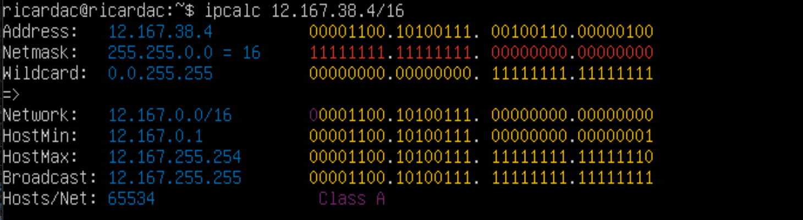
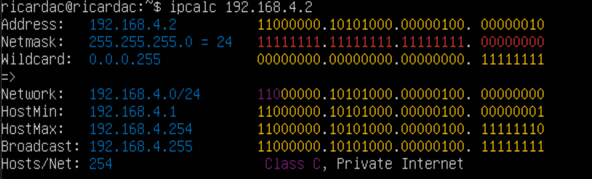
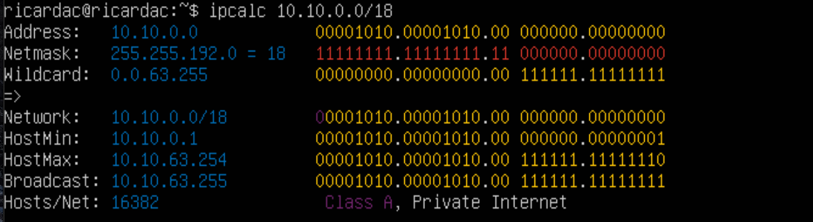
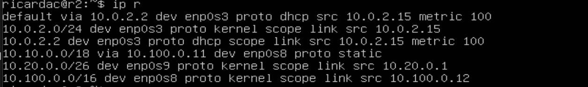
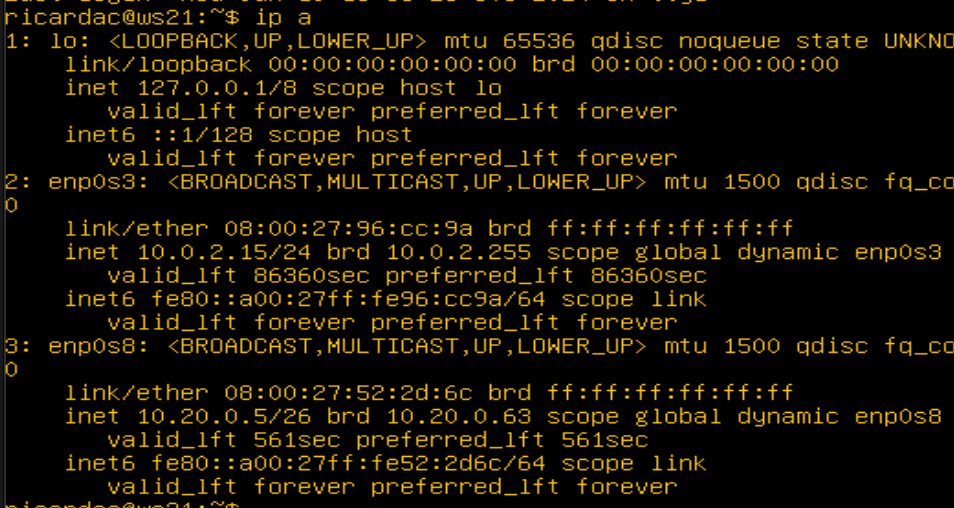
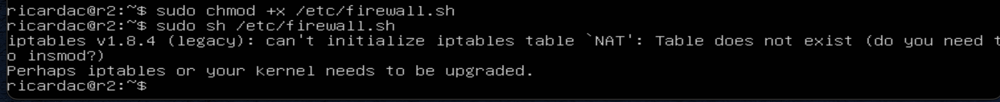
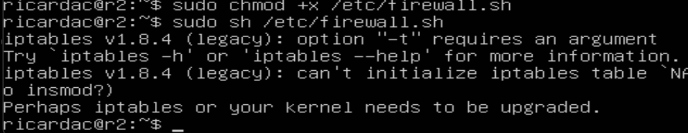

# Сети в Linux

## Part 1. Инструмент **ipcalc**

- Поднятие виртуальной машины ws1


#### 1.1. Сети и маски
##### Определи и запиши в отчёт:
##### 1) Адрес сети *192.167.38.54/13*
- Адрес сети 192.160.0.0


##### 2) Перевод маски *255.255.255.0* в префиксную и двоичную запись, */15* в обычную и двоичную, *11111111.11111111.11111111.11110000* в обычную и префиксную

- 255.255.255.0 = /24 в префиксной
- 255.255.255.0 = 11111111.11111111.11111111.00000000 в двоичной


- /15 = 255.254.0.0 в обычной 
- /15 = 11111111.11111110.00000000.00000000 в двоичной


- 11111111.11111111.11111111.11110000 = 255.255.255.240 в обычной
- 11111111.11111111.11111111.11110000 = /28 в префиксной


##### 3) Минимальный и максимальный хост в сети *12.167.38.4* при масках: */8*, *11111111.11111111.00000000.00000000*, *255.255.254.0* и */4*
- Для /8 min:12.0.0.1   max:12.255.255.254


- Для /4 min:0.0.0.1    max:15.255.255.254


- Для /16 = 11111111.11111111.00000000.00000000 min:12.167.0.1    max:12.167.255.254



- Для /23 = 255.255.254.0 min:12.167.38.1    max:12.167.39.254


#### 1.2. localhost
##### Определи и запиши в отчёт, можно ли обратиться к приложению, работающему на localhost, со следующими IP: *194.34.23.100*, *127.0.0.2*, *127.1.0.1*, *128.0.0.1*

- проверяем через команду ping
- 194.34.23.100 нет
- 127.0.0.2 да
- 127.1.0.1 да
- 128.0.0.1 нет


#### 1.3. Диапазоны и сегменты сетей
##### Определи и запиши в отчёт:
##### 1) Какие из перечисленных IP можно использовать в качестве публичного, а какие только в качестве частных: *10.0.0.45*, *134.43.0.2*, *192.168.4.2*, *172.20.250.4*, *172.0.2.1*, *192.172.0.1*, *172.68.0.2*, *172.16.255.255*, *10.10.10.10*, *192.169.168.1*

- везде используем ipcalc


``10.0.0.45`` - private <br>


``134.43.0.2`` - public <br>



``192.168.4.2`` - private <br>


``172.20.250.4`` - private <br>


``172.0.2.1`` - public <br>


``192.172.0.1`` - public <br>


``172.68.0.2`` - public <br>


``172.16.255.255`` - private <br>


``10.10.10.10`` - private <br>


``192.169.168.1`` - public <br>


##### 2) Какие из перечисленных IP адресов шлюза возможны у сети *10.10.0.0/18*: *10.0.0.1*, *10.10.0.2*, *10.10.10.10*, *10.10.100.1*, *10.10.1.255*



Диапозон от 10.10.0.1 до 10.10.63.254

``10.0.0.1`` - нет<br>
``10.10.0.2`` - да<br>
``10.10.10.10`` - да<br>
``10.10.100.1`` - нет<br>
``10.10.1.255`` - да<br>

## Part 2. Статическая маршрутизация между двумя машинами


**== Задание ==**

##### Подними две виртуальные машины (далее -- ws1 и ws2).


##### С помощью команды `ip a` посмотри существующие сетевые интерфейсы.

- В отчёт помести скрин с вызовом и выводом использованной команды.


##### Опиши сетевой интерфейс, соответствующий внутренней сети, на обеих машинах и задать следующие адреса и маски: ws1 - *192.168.100.10*, маска */16*, ws2 - *172.24.116.8*, маска */12*.

- В отчёт помести скрины с содержанием изменённого файла *etc/netplan/00-installer-config.yaml* для каждой машины.


##### Выполни команду `netplan apply` для перезапуска сервиса сети.
- В отчёт помести скрин с вызовом и выводом использованной команды.


#### 2.1. Добавление статического маршрута вручную
##### Добавь статический маршрут от одной машины до другой и обратно при помощи команды вида

`ip r add`.

<br>ВАЖНО<br>
- Зайти в настройки сети в VirtualBox и поставить вместо NAT Internal Network


##### Пропингуй соединение между машинами.
- В отчёт помести скрин с вызовом и выводом использованных команд.


#### 2.2. Добавление статического маршрута с сохранением
##### Перезапусти машины.
##### Добавь статический маршрут от одной машины до другой с помощью файла *etc/netplan/00-installer-config.yaml*.
- В отчёт помести скрин с содержанием изменённого файла *etc/netplan/00-installer-config.yaml*.


##### Пропингуй соединение между машинами.
- В отчёт помести скрин с вызовом и выводом использованной команды.


#### 3.1. Скорость соединения
##### Переведи и запиши в отчёт: 8 Mbps в MB/s, 100 MB/s в Kbps, 1 Gbps в Mbps.

- 8 Mbps = 1 MB/s
- 100 MB/s = 819200 Kbps
- 1 Gbps = 1024 Mbps

#### 3.2. Утилита **iperf3**
##### Измерь скорость соединения между ws1 и ws2.

- В отчёт помести скрины с вызовом и выводом использованных команд.


## Part 4. Сетевой экран


**== Задание ==**

*В данном задании используются виртуальные машины ws1 и ws2 из Части 2*

#### 4.1. Утилита **iptables**
##### Создай файл */etc/firewall.sh*, имитирующий фаерволл, на ws1 и ws2:
```shell
#!/bin/sh

# Удаление всех правил в таблице «filter» (по-умолчанию).
iptables -F
iptables -X
```
##### Нужно добавить в файл подряд следующие правила:

##### 1) На ws1 примени стратегию, когда в начале пишется запрещающее правило, а в конце пишется разрешающее правило (это касается пунктов 4 и 5).

##### 2) На ws2 примени стратегию, когда в начале пишется разрешающее правило, а в конце пишется запрещающее правило (это касается пунктов 4 и 5).

##### 3) Открой на машинах доступ для порта 22 (ssh) и порта 80 (http).

##### 4) Запрети *echo reply* (машина не должна «пинговаться», т.е. должна быть блокировка на OUTPUT).

##### 5) Разреши *echo reply* (машина должна «пинговаться»).

- В отчёт помести скрины с содержанием файла */etc/firewall* для каждой машины.


##### Запусти файлы на обеих машинах командами 
`chmod +x /etc/firewall.sh` и `/etc/firewall.sh`

- В отчёт помести скрины с запуском обоих файлов;


- В отчёте опиши разницу между стратегиями, применёнными в первом и втором файлах.
- В каждом правиле используется опция -j выбрать действия, если правило прошло. Это делает обработку правил, которые выше замещающими, то-есть если как сказанно в задании сделать для ws1 сначала запрещающее правило, то машина не будет пинговаться, так как правило по запрету стоит выше чем правило на разрещение. Аналогично для ws2, где выше разрешающее правило, а значит машина будет пинговаться

#### 4.2. Утилита **nmap**
##### Командой **ping** найди машину, которая не «пингуется», после чего утилитой **nmap** покажи, что хост машины запущен.

*Проверка: в выводе nmap должно быть сказано: `Host is up`*.
- В отчёт помести скрины с вызовом и выводом использованных команд **ping** и **nmap**.


##### Сохрани дампы образов виртуальных машин


## Part 5. Статическая маршрутизация сети


**== Задание ==**
##### Подними пять виртуальных машин (3 рабочие станции (ws11, ws21, ws22) и 2 роутера (r1, r2)) по схеме%:


#####Задаём следующие настройки виртуальным машинам:

1) Для машины Router r1 в Настроить - Сеть выставляем:

 - Adapter_1 оставляем как есть (Тип подключения: NAT);
 - Включаем Adapter_2, выставляем Тип подключения: Внутренняя сеть(Internal Network) и устанавливаем имя  net_1;
 - Включаем Adapter_3, выставляем Тип подключения: Внутренняя сеть(Internal Network) и устанавливаем имя  net_2;

2) Для машины Router r2:

 - Adapter_1 оставляем как есть (Тип подключения: NAT);
 - Включаем Adapter_2, выставляем Тип подключения: Внутренняя сеть(Internal Network) и устанавливаем имя  net_2;
 - Включаем Adapter_3, выставляем Тип подключения: Внутренняя сеть(Internal Network) и устанавливаем имя  net_3;

3) Для машины PC-ws11 в Настроить - Сеть:

 - Adapter_1 оставляем как есть (Тип подключения: NAT);
 - Включаем Adapter_2, выставляем Тип подключения: Внутренняя сеть(Internal Network) и устанавливаем имя  net_1;

4) Для машины PC-ws21 в Настроить - Сеть:

 - Adapter_1 оставляем как есть (Тип подключения: NAT);
 - Включаем Adapter_2, выставляем Тип подключения: Внутренняя сеть(Internal Network) и устанавливаем имя  net_3;

5) Для машины PC-ws22 в Настроить - Сеть:

 - Adapter_1 оставляем как есть (Тип подключения: NAT);
 - Включаем Adapter_2, выставляем Тип подключения: Внутренняя сеть(Internal Network) и устанавливаем имя  net_3;

#### 5.1. Настройка адресов машин
##### Настрой конфигурации машин в *etc/netplan/00-installer-config.yaml*

- В отчёт помести скрины с содержанием файла *etc/netplan/00-installer-config.yaml* для каждой машины.


- `sudo netplan apply`

##### Перезапусти сервис сети. Если ошибок нет, то командой `ip -4 a` проверь, что адрес машины задан верно. Также пропингуй ws22 с ws21. Аналогично пропингуй r1 с ws11.

- `ip -4 a`


Пропингуем `ws22` с `ws21` с помощью команды

 - `ping -c 5 10.20.0.10`


Пропингуем `r1` с `ws11` с помощью команды

 - `ping -c 10.10.0.1`


#### 5.2. Включение переадресации IP-адресов
##### Для включения переадресации IP, выполни команду на роутерах:

`sudo sysctl -w net.ipv4.ip_forward=1`
*При таком подходе переадресация не будет работать после перезагрузки системы.*

- В отчёт помести скрин с вызовом и выводом использованной команды.


##### Открой файл */etc/sysctl.conf* и раскомментируем следующую строку:

 - `sudo nano /etc/sysctl.conf`
 - `net.ipv4.ip_forward = 1`

*При использовании этого подхода, IP-переадресация включена на постоянной основе.*

- В отчёт помести скрин с содержанием изменённого файла */etc/sysctl.conf*.


#### 5.3. Установка маршрута по-умолчанию
##### Настрой маршрут по-умолчанию (шлюз) для рабочих станций. Для этого добавь `default` перед IP роутера в файле конфигураций.

- В отчёт помести скрин с содержанием файла *etc/netplan/00-installer-config.yaml*;


##### Вызови `ip r` и покажи, что добавился маршрут в таблицу маршрутизации.
- В отчёт помести скрин с вызовом и выводом использованной команды.


 
##### Пропингуем с ws11 роутер r2, пинг не пройдёт, т.к. роутер "не знает" куда вернуть ответ, при этом передача пакетов с машины осуществляется.

Запускаем на `r2` утилиту tcpdump, она позволяет прослушать порты и вывести на экран информацию с каких IP адресов приходят пакеты. В данном случае слушаем интерфейс `enp0s8`

`tcpdump -tn -i enp0s8`

Запускаем `ping` на `ws11`


На экране должно `r2` должно появиться


#### 5.4. Добавление статических маршрутов
##### Добавь в роутеры r1 и r2 статические маршруты в файле конфигураций. 

- В отчёт помести скрины с содержанием изменённого файла *etc/netplan/00-installer-config.yaml* для каждого роутера.


##### Вызови `ip r` и покажи таблицы с маршрутами на обоих роутерах. Пример таблицы на r1:

- В отчёт помести скрин с вызовом и выводом использованной команды.





##### Запусти команды на ws11:
`ip r list 10.10.0.0/18` и `ip r list 0.0.0.0/0`


Для адреса 10.10.0.0/18 был выбран маршрут, отличный от 0.0.0.0/0 (он попадает под маршрут по-умолчанию), т.к. машина ws11 соединена с сетью 10.10.0.0/18 по своему IP-адресу 10.10.0.2, для других адресов используется маршрут по умолчанию, который указан в файле 10.10.0.1.

#### 5.5. Построение списка маршрутизаторов
##### Запусти на r1 команду дампа:

`tcpdump -tnv -i enp0s8`

 - -n - не конвертировать адреса в имена;
 - -t - не выводить время при выводе каждой строкчи дампа;
 - -v - при синтаксическом анализе и выводить более подробную информацию. Например, печатаются время создания, общая длина и параметры IP-пакета. Также включает дополнительные проверки целостности пакетов, такие как проверка контрольной суммы заголовка IP и ICMP.

##### При помощи утилиты **traceroute** построй список маршрутизаторов на пути от ws11 до ws21.

- В отчёт помести скрины с вызовом и выводом использованных команд (tcpdump и traceroute);


 - Каждый пакет проходит на своем пути определенное количество узлов, пока достигнет своей цели. Причем, каждый пакет имеет свое время жизни. Это количество узлов, которые может пройти пакет перед тем, как он будет уничтожен. Этот параметр записывается в заголовке TTL, каждый маршрутизатор, через который будет проходить пакет уменьшает его на единицу. При TTL=0 пакет уничтожается, а отправителю отсылается сообщение Time Exceeded.

 - Команда traceroute linux использует UDP пакеты. Она отправляет пакет с TTL=1 и смотрит адрес ответившего узла, дальше TTL=2, TTL=3 и так пока не достигнет цели. Каждый раз отправляется по три пакета и для каждого из них измеряется время прохождения. Пакет отправляется на случайный порт, который, скорее всего, не занят. Когда утилита traceroute получает сообщение от целевого узла о том, что порт недоступен трассировка считается завершенной.

#### 5.6. Использование протокола **ICMP** при маршрутизации
##### Запусти на r1 перехват сетевого трафика, проходящего через enp0s8 с помощью команды:

`tcpdump -n -i enp0s8 icmp`

##### Пропингуй с ws11 несуществующий IP (например, *10.30.0.111*) с помощью команды:

`ping -c 1 10.30.0.111`

- В отчёт помести скрин с вызовом и выводом использованных команд.


##### Сохрани дампы образов виртуальных машин.


## Part 6. Динамическая настройка IP с помощью **DHCP**


**== Задание ==**

*В данном задании используются виртуальные машины из Части 5.*

##### Для r2 настрой в файле */etc/dhcp/dhcpd.conf* конфигурацию службы **DHCP**:

##### 1) Укажи адрес маршрутизатора по-умолчанию, DNS-сервер и адрес внутренней сети.

Если утилита isc-dhcp-server ещё не установлена, то файла /etc/dhcp/dhcpd.conf ещё не существует в нужном виде. Соотвтетственно для работы с протоколом DHCP сначала надо установить эту утилиту

`sudo apt-get install isc-dhcp-server`

###### Теперь для r2 можем настроить в файле /etc/dhcp/dhcpd.conf конфигурацию службы DHCP

 - указываем адрес маршрутизатора по-умолчанию, DNS-сервер и адрес внутренней сети.
 - Открываем файл /etc/dhcp/dhcpd.conf для редактирования

sudo nano /etc/dhcp/dhcpd.conf

Так выглядит только что открытый файл dhcpd.conf:


- Вносим изменения:


##### 2) В файле *resolv.conf* пропиши `nameserver 8.8.8.8`.

 - `sudo nano /etc/resolv.conf`


##### Перезагрузи службу **DHCP** командой `systemctl restart isc-dhcp-server`. Машину ws21 перезагрузи при помощи `reboot` и через `ip a` покажи, что она получила адрес. Также пропингуй ws22 с ws21.


- В отчёт помести скрины с вызовом и выводом использованных команд.

 - `systemctl restart isc-dhcp-server`


 - `systemctl status isc-dhcp-server`

 

##### Изменим настройки машин ws21 и ws22 в файле конфигурации, чтобы сделать протокол DHCP активным.

 
 

Перезагружаем виртуальную машину ws21:

`sudo reboot`

Проверяем присвоенный устройствам адрес:

`ip a`

 
 

Проверим соединение машины ws22 с ws21:

`ping -c 5 10.20.0.5`

 


##### Укажи MAC адрес у ws11, для этого в *etc/netplan/00-installer-config.yaml* надо добавить строки: 

`macaddress: 10:10:10:10:10:BA`, `dhcp4: true`.


- В отчёт помести скрин с содержанием изменённого файла *etc/netplan/00-installer-config.yaml*.
 

 - Выключаем машину ws11 и заходим в менеджер виртуальных машин VirtualBox и там настраиваем ws11 MAC-адрес
 


##### Для r1 настрой аналогично r2, но сделай выдачу адресов с жесткой привязкой к MAC-адресу (ws11). Проведи аналогичные тесты.


`sudo apt-get install isc-dhcp-server`

`sudo nano /etc/dhcp/dhcpd.conf`

 

`sudo nano /etc/resolv.conf`

 

`systemctl restart isc-dhcp-server`

 

`sudo systemctl status isc-dhcp-server`

 

 - Cмотрим какой адрес назначен машине ws11:

 

 - пингуем ws11

 

##### Запроси с ws21 обновление ip адреса.

Проверяем IP до обновления

 

Запросим с ws21 обновление ip адреса с помощью команды

`sudo dhclient -v`

 - -v - будет выведена дополнительная информация.

  

Проверяем IP после обновления 

 

Выполним команду для удаления старого IP адреса

`sudo dhclient -r`

-r - явно освобождает текущую аренду ip адреса.

Проверим IP адреса

 

###### В части 6 были использованы следующие опции DHCP протокола:

 - option routers ip-address [, ip-address...]; - адреса шлюзов для клиентской сети. Маршрутизаторы должны быть перечислены в порядке предпочтительности.
 - option domain-name-servers ip-address [, ip-address...]; - Список DNS серверов доступных клиенту Сервера должны быть перечислены в порядке предпочтительности. 
 Сохраняем дампы образов виртуальных машин.


##### Сохрани дампы образов виртуальных машин.

 


## Part 7. **NAT**


**== Задание ==**

##### В файле */etc/apache2/ports.conf* на ws22 и r1 измени строку `Listen 80` на `Listen 0.0.0.0:80`, то есть сделай сервер Apache2 общедоступным.

 `sudo nano /etc/apache2/ports.conf`

 
 

##### Запусти веб-сервер Apache командой на ws22 и r1.

`service apache2 start`

 
 

##### Добавь в фаервол, созданный по аналогии с фаерволом из Части 4, на r2 следующие правила:

##### 1) Удаление правил в таблице filter - `iptables -F`;
##### 2) Удаление правил в таблице "NAT" - `iptables -F -t nat`;
##### 3) Отбрасывать все маршрутизируемые пакеты - `iptables --policy FORWARD DROP`.

##### Запусти файл также, как в Части 4.

 
 

##### Проверь соединение между ws22 и r1 командой `ping`.
*При запуске файла с этими правилами, ws22 не должна «пинговаться» с r1.*

 

##### Добавь в файл ещё одно правило:
##### 4) Разрешить маршрутизацию всех пакетов протокола **ICMP**.
##### Запусти файл также, как в Части 4.

 
 

##### Проверь соединение между ws22 и r1 командой `ping`.

*При запуске файла с этими правилами, ws22 должна «пинговаться» с r1.*
- В отчёт помести скрины с вызовом и выводом использованной команды.

 
 


##### Добавь в файл ещё два правила:

##### 5) Включи **SNAT**, а именно маскирование всех локальных ip из локальной сети, находящейся за r2 (по обозначениям из Части 5 - сеть 10.20.0.0).
##### 6) Включи **DNAT** на 8080 порт машины r2 и добавить к веб-серверу Apache, запущенному на ws22, доступ извне сети.


 

Значения использованных опций:

 - t - указывает на используемую таблицу;
 - p - указывает протокол, такие как tcp, udp, udplite и другие, поддерживаемые
 системой, ознакомиться со списком можно в файле /etc/protocols;
 - m - подключает указанный модуль;
 - s - указывает адрес источника пакета, в качестве значения можно указать как один IP-адрес, так и диапазон;
 - i - задает входящий сетевой интерфейс;
 - o - указывает исходящий сетевой интерфейс;
 -  --dport - порт получателя пакета;
 - DNAT — подменяет адрес получателя в заголовке IP-пакета, основное применение — предоставление доступа к сервисам снаружи, находящимся внутри сети;
 - SNAT — служит для преобразования сетевых адресов, применимо, когда за сервером находятся машины, которым необходимо предоставить доступ в Интернет, при этом от провайдера имеется статический IP-адрес.

 - SNAT и DNAT
 - NAT — это аббревиатура для преобразования сетевых адресов. NAT возникает при
 изменении одного из IP-адресов в заголовке IP-пакета, т. е. IP-адреса источника(source-addr) или IP-адреса назначения (dest-addr).


##### Запусти файл также, как в Части 4.
##### Проверь соединение по TCP для **SNAT**: для этого с ws22 подключиться к серверу Apache на r1 командой:

 

`telnet 10.100.0.11 80`

 


##### Проверь соединение по TCP для **DNAT**: для этого с r1 подключиться к серверу Apache на ws22 командой `telnet` (обращаться по адресу r2 и порту 8080).

 

##### Сохрани дампы образов виртуальных машин.

 


## Part 8. Дополнительно. Знакомство с **SSH Tunnels**


**== Задание ==**
*В данном задании используются виртуальные машины из Части 5.*

##### Запусти на r2 фаервол с правилами из Части 7.

 

##### Запусти веб-сервер **Apache** на ws22 только на localhost (то есть в файле */etc/apache2/ports.conf* измени строку `Listen 80` на `Listen localhost:80`).

 

##### Воспользуйся *Local TCP forwarding* с ws21 до ws22, чтобы получить доступ к веб-серверу на ws22 с ws21.

###### Пробрасывать порт от сервера будем по следующему алгоритму:

 - На машине `ws22`: создадим соединение с машины `ws22`, на которой установлен сервер ssh, с машиной ws 21.
 - На машине `ws22`: с помощью команды ssh -L прокинем "прямое" соединение с машины `ws21` на машину `ws22`.

`ssh 10.20.0.10`

 

`ssh -L 8080:127.0.0.1:80 10.20.0.20`
 
 


На машине `ws21` запускаем утилиту `telnet`

`telnet 127.0.0.1 8080`

 

Проверяем запущенные процессы на машине ws21 и "убиваем" процесс `1331`  отвечающий за соединение с сервером 

`ps aux | grep sshd`

 

`kill -9 1331`

Когда процесс, на машине `ws21`, отвечающий за соединение, будет "убит", появится сообщение на машине `ws22`

 

##### Воспользуйся *Remote TCP forwarding* c ws11 до ws22, чтобы получить доступ к веб-серверу на ws22 с ws11.

Переадресация удаленного порта противоположна переадресации локального порта. Это позволяет перенаправить порт на удалённом компьютере (сервер ssh) на порт на локальном компьютере (клиент ssh), который затем перенаправляется на порт на компьютере назначения. В этом типе переадресации сервер SSH прослушивает заданный порт и туннелирует любое соединение с этим портом на указанный порт локального клиента SSH, который затем подключается к порту на целевом компьютере. Машина назначения может быть локальной или любой другой машиной. Удаленное перенаправление портов в основном используется для предоставления доступа к внутренней службе кому-то извне.

Из-за того что на роутере `r2` настроен firewall, подключиться к серверу Apache на машине `ws22` с помощью команды `ssh -L`, с машины `ws11`, не получится (роутер `r2` не пропустит команду). В этом случае необходимо воспользоваться командой ssh -R. Выполнить её необходимо на машине `ws22`. Это выполняется за несколько шагов:

На машине `ws11`: На машине `ws11`: переход с машины `ws11` на роутер `r2` с помощью ssh (роутер не позволит сразу перейти на машину `ws22`);
На машине `ws11`: переход с роутера `r2` на машину `ws22` с помощью ssh;
На машине `ws11`: проброс туннеля с машины `ws22` на машину `ws11` с помощью `ssh -R`;

Пробрасываем маршрут. Запускаем с машины `ws11` команду.

`ssh 10.100.0.12`

 
 

Благодаря этой команде находясь на машине `ws11` можно увидить следующую картину, в которой изменится хост текущей машины на `r2`

Далее находясь физически на той же машине `ws11` с именем хоста `r2`, вводим следующую команду

`ssh 10.20.0.20`

 


Находясь на машине `ws11`, получим следующий результат `r2 -> ws22`

 

В предыдущей части на роутере `r2` был настроен на `fireWall`, который не пропускает проходящие пакеты из другой сети. Поэтому сначала необходимо пробросить тунель от `ws22` к `ws11`. Для этого запускаем на машине `ws11` команду

`ssh -R 10.10.0.2:8080:127.0.0.1:80 10.10.0.2`

Описание команды:

`ssh -R [удаленный_адрес:]удаленный_порт:локальный_адрес:локальный_порт [пользователь@]сервер`

 

##### Для проверки, сработало ли подключение, переходим во второй терминал (для этого находясь в терминале машины `ws11` нажимаем `option + fn + F2 или Alt + F2`) и выполяем команду (`telnet 127.0.0.1 [локальный порт]`). В момент выполнения данной команды необходимо нажать любую клавишу

`telnet 127.0.0.1 8080`

 

##### Сохрани дампы образов виртуальных машин.

 

